## What is it

This is very basic integration of the [ospRay](https://github.com/ospray/OSPRay) render engine into Softimage. Compiled addon can be downloaded [here](https://ssoftadd.github.io/ospRayPage.html). The main goal of the project not only to create integration of some third-party renderer into Softimage, but also to develop a universal template, which can be used for integrations of any other external renderer.

## What features are supported from Softimage

### Polygon mesh objects

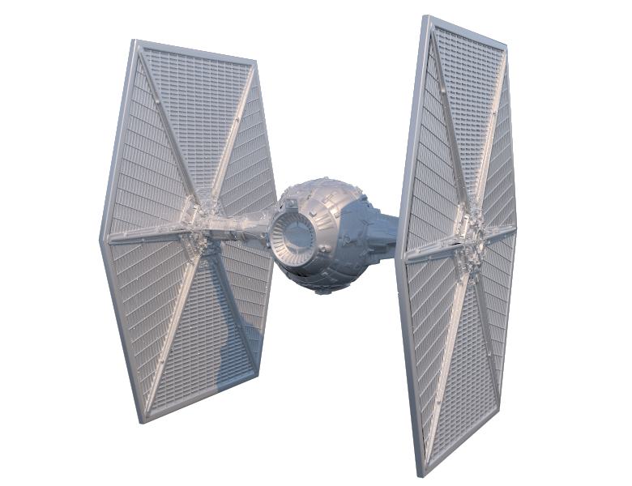

If mesh contains uvs, then the renderer use only the first one. If mesh contains vertex colors, then the renderer also use only the first one. From geometry property the renderer use the following parameters

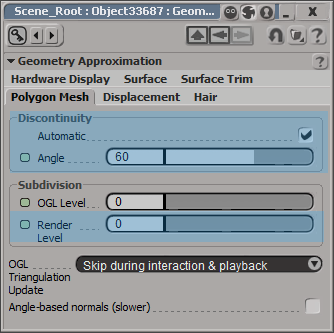

### Strands

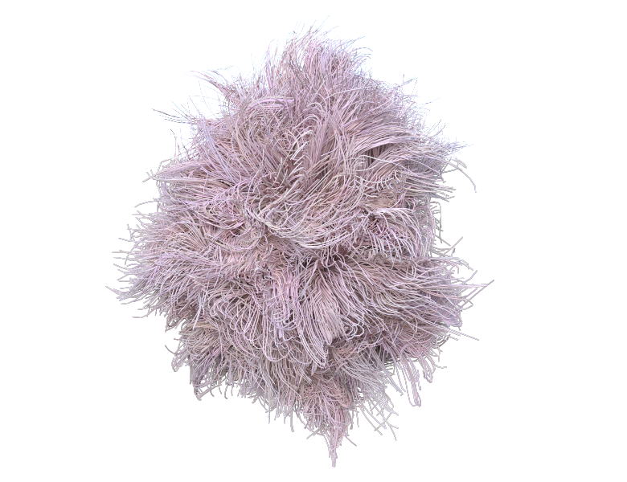

If pointcloud has non-empty ```StrandPosition``` attribute, then the renderer interpret this pointcloud as only strands object. It renders each strand as curve primitive. The following ICE-attributes are used: ```Color``` and ```Size```.

### Pointclouds

If pointcloud object does not contains strands, then the renderer try to interpet it as spheres, box or volume primitive. Each particle with shape ```Sphere``` form spheres primitive, with shape ```Box``` form boxes primitive (which always axis-aligned), with ```Point``` shape form particle volume primitive.

##### Spheres

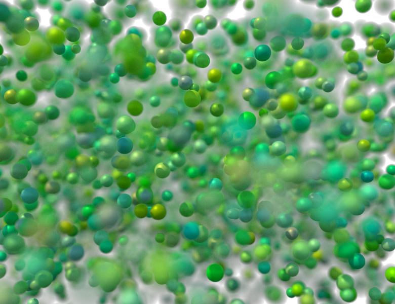

Spheres primitive use ```Size``` and ```Color``` attributes for the radius and color respectively.

##### Boxes

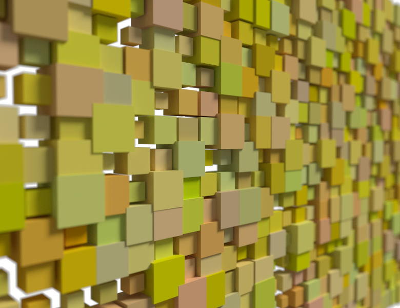

Boxes primitive use ```Size``` and ```Color``` attributes for the box size and color respectively.

##### Particles Volume

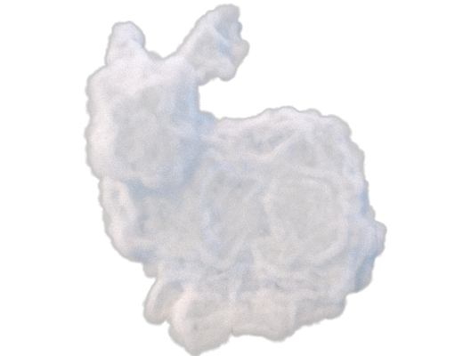

This primitive renders as an cloud of volume particles. Only ```Size``` attribute is affected. The color and density of volume can be defined with the help of ```OSP Build Transfer Function``` ICE-node. Also there is node ```OSP Isosurface``` which allows to convert the particle volumes into isosurface (something similar to metaballs).

### Hairs

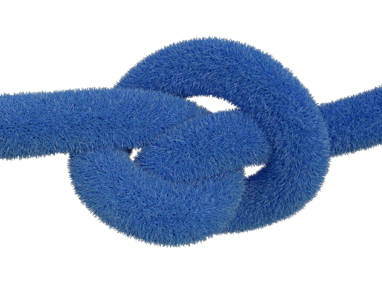

The renderer recognize default Softimage hair objects and render it as curves primitive.

### Light sources

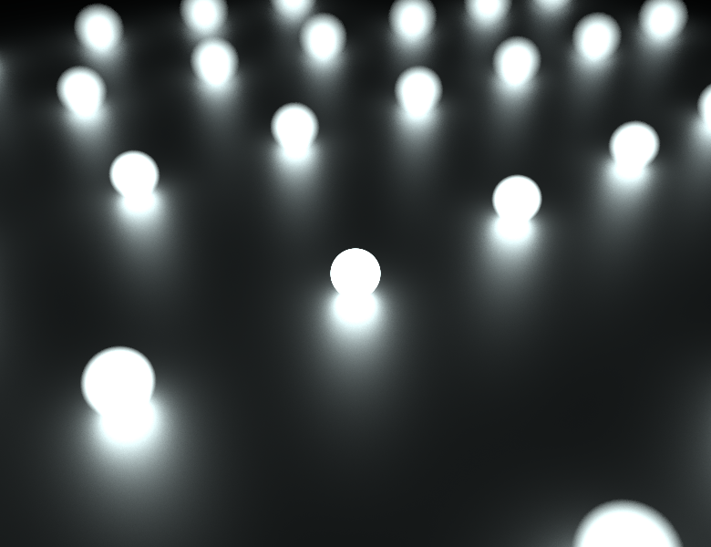

The renderer understand all standard types of Softimage lights: point, spot and infinite. For these types of light the renderer use the following parameters

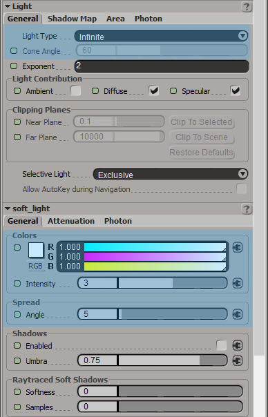

If the light has active ```Area Light``` then it interpret as rectangular area light. The rendere use the following area light parameters

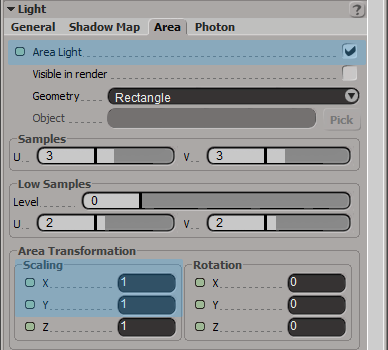

The color of the scene ambient light also considered as a light source.

### HDR environment lights

There is possibility to use hdr-image as environment light. It can be added by usin Environment shader of the render pass. The renderer use the following parameters

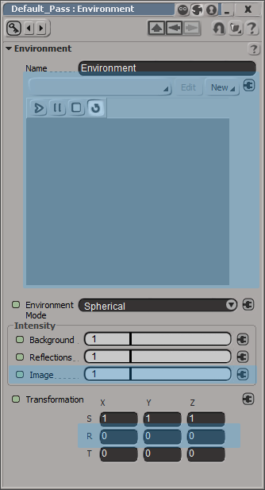

```Image``` parameter used for tweaking light intensity, ```X, Y, Z``` rotations used for rotation of the environment map.

### Camera

The renderer use the following parameters of the perspective Softimage camera

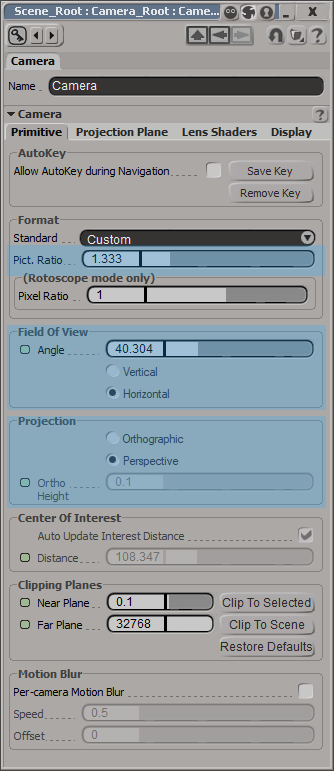

### Material previews

The renderer generate previews on Material Manager and in material previews. Preview of the shader nodes are not supported.

### Textures

The renderer understand standard Image shader node for texturing. It only one parameter for tiling

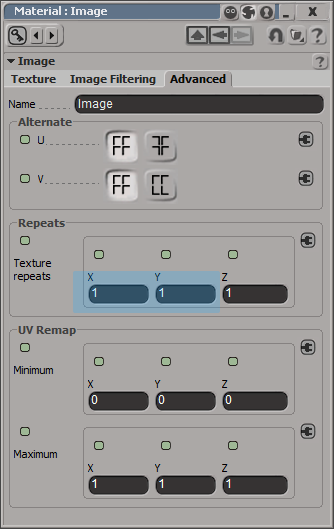

But you can change the image source with any effect (crop, blur, flip), and all of them will be effected on the renderer.

## What ospRay features are supported

* Three different renderers: ```sciVis```, ```AO``` and ```PathTracer```. You can switch between these render modes in render settings
* Convert volume particles into isosurface by using special ICE-node
* Use Hošek-Wilkie sky model as background light. It can be activated on render settings
* Motion blur. It can be activated and tweaked in render settings
* One rendering task can also save three additional render channels: albedo, depth and normal
* Path tracer renderer supports all materials. Most parameters (color or float) of these materials can be textured. SciVis and AO renderers supports only the simplest ```Obj``` material
* Depth of field. The amount of defocus can be controlled in render settings. The interest point of the camera define the focus point
* Panoramic camera


## What is not supported from ospRay

* Subdivision geometry primitive. Because Softmage has it's own subdivision functionality
* Planes primitive
* Some parameters of the light sources (for example ```intensityQuantity```, ```intensityDistribution``` or ```c0``` for spot light), because default Softimage lights does not contains any analogue of these parameters
* Denoising and tonemapping image operations
* Distributed rendering
* All types of volumes (except particle volume): Structured Regular Volume, Structured Spherical Volume, AMR Volume, Unstructured Volume and VDB Volume
* Volume textures
* Vector ```ior``` parameter in the Metal shader
* Texture transformations (except texture tiling)
* Stereo mode of the render camera
* Debug renderer